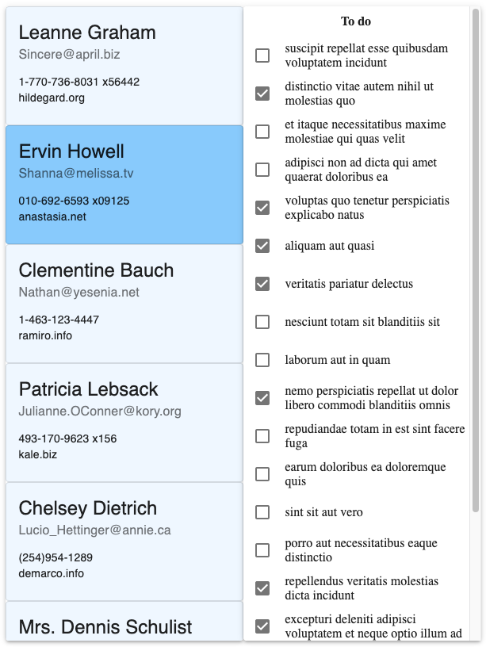

# Redux-Saga demo

Demo project showing use of the following packages:
* Redux
* Redux Actions
* Redux Saga
* Redux Saga Routines
* Reselect
* React Router
* Material-UI
* lodash
* axios
* ...

Other templates:
* [React Context](https://github.com/christiaanjl/react-context-template)
* [Redux](https://github.com/christiaanjl/react-redux-template)
* [Angular](https://github.com/christiaanjl/angular-template)


## UI
Initial project fetches users and their to-do items from [jsonplaceholder](https://jsonplaceholder.typicode.com)



## Project structure

```
src
├── api
│   └── remoteApi.js
├── constants
│   ├── Status.js
│   └── Types.js
├── sagas
│   ├── createRoutineSagaWatcher.js
│   ├── todosSaga.js
│   └── usersSaga.js
├── selectors
│   ├── todosSelector.js
│   └── usersSelector.js
├── store
│   ├── todos
│   │   ├── TodosAction.js
│   │   └── TodosReducer.js
│   ├── users
│   │   ├── UsersAction.js
│   │   └── UsersReducer.js
│   ├── rootReducer.js
│   └── rootStore.js
├── views
│   ├── components
│   │   ├── Header.jsx
│   │   └── ProgressSpinner.jsx
│   ├── users-page
│   │   ├── components
│   │   │   ├── TodoCard.jsx
│   │   │   ├── TodoList.jsx
│   │   │   ├── UserCard.jsx
│   │   │   └── UsersList.jsx
│   │   └── UsersPage.jsx
│   └── App.jsx
├── .env
├── index.js
└── setupTests.js
```

Work in progress; omissions include, testing (Cypress, React Testing Library, Jest), Storybook, fetched data validation, etc...

### `npm start`

Runs the app in the development mode.<br />
Open [http://localhost:3000](http://localhost:3000) to view it in the browser.


